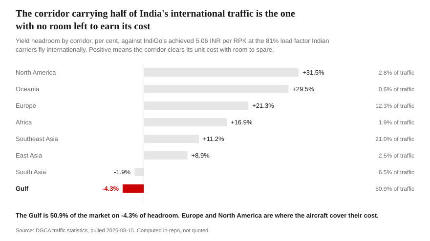
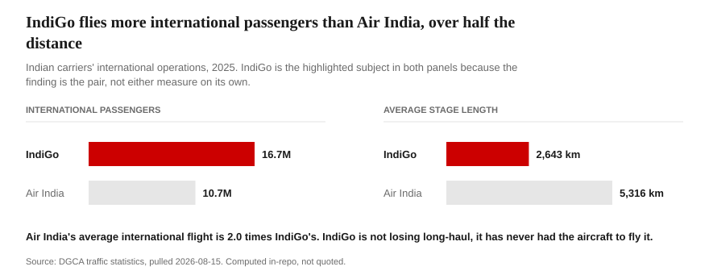
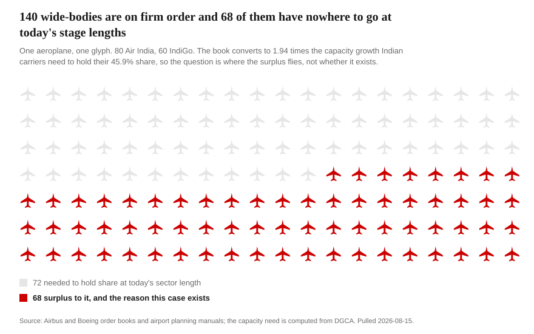
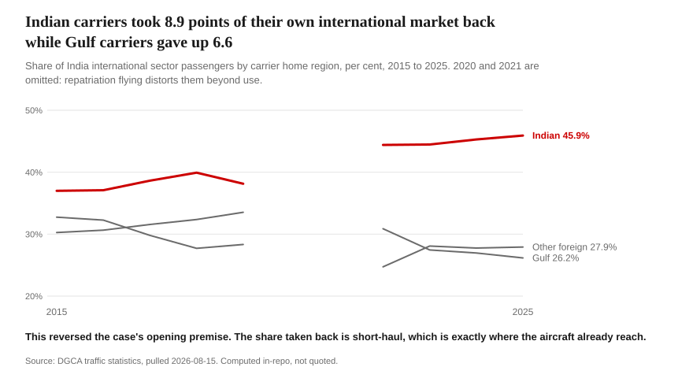
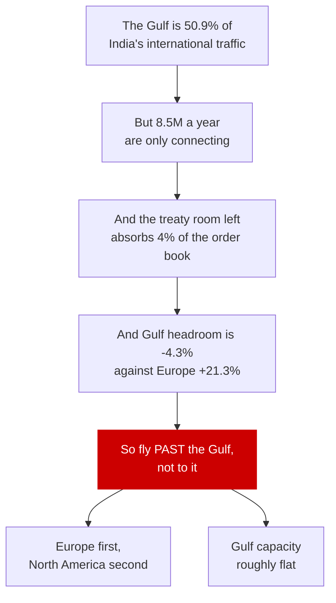
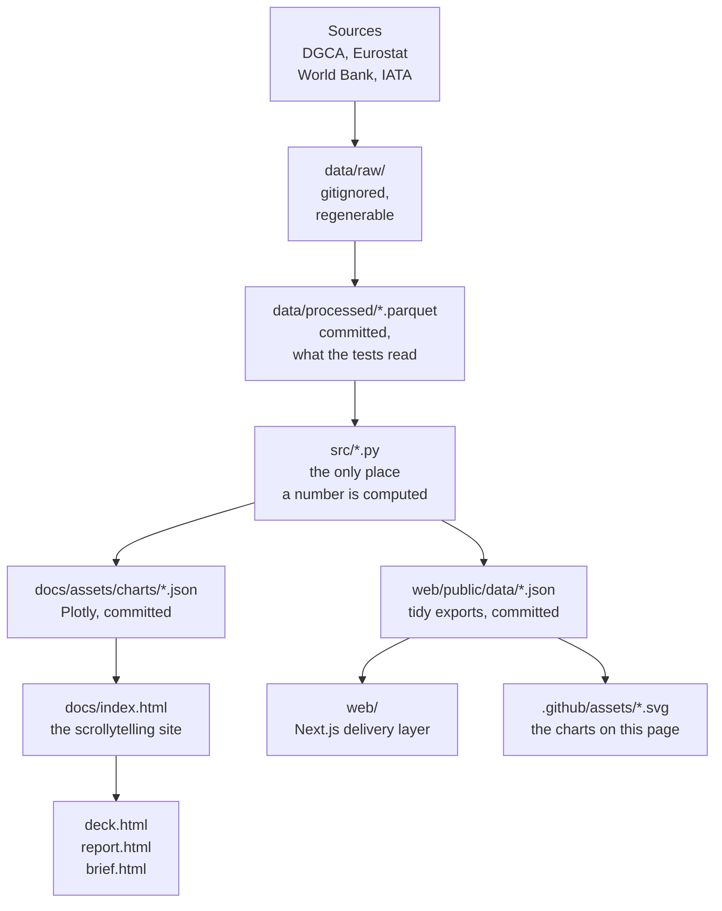

# India's Wide-Body Window

**Where should Indian carriers deploy their next 100 long-haul aircraft, and can the
India-Gulf corridor absorb them?**

[](https://github.com/DogInfantry/india-widebody-window/actions/workflows/refresh.yml)


| The engagement | |
|---|---|
| **Client** | IndiGo, network and fleet strategy |
| **The decision** | Where 60 A350-900s on firm order go first, and what to do with 40 unconverted purchase rights |
| **Against** | Air India, 80 wide-bodies on firm order |
| **Horizon** | Deployment through 2030 |
| **Evidence** | DGCA, Eurostat, IATA and World Bank. Every figure computed in-repo, none typed by hand |

**Read it** on [the site](https://india-widebody-window.vercel.app), as
[a deck](https://doginfantry.github.io/india-widebody-window/deck.html), in
[print](https://doginfantry.github.io/india-widebody-window/report.html), or as
[a one-pager](https://doginfantry.github.io/india-widebody-window/brief.html).
**Or jump to** [the answer](#the-answer), [the numbers](#the-numbers-this-case-turns-on), or
[the ten times it changed](docs/pivot_log.md).

A commercial aviation market entry case in the style of Bain Capability Network Advanced
Manufacturing & Services work. Python analysis layer, a scrollytelling site and a Next.js
delivery layer, no PowerPoint and no Excel anywhere in the pipeline.

---

## The answer

**Compete with the Gulf hubs. Do not fly more aircraft to them. Europe first, North America
second, Gulf capacity roughly flat.**

The India-Gulf corridor carries 50.9% of India's international sector traffic, 39.7M passengers
in 2025, and is 4.1 times the size of India's entire direct Europe market. It is still the
wrong place to put a wide-body. About 8.5M of those passengers a year are not going to the Gulf
at all, they are connecting through Dubai, Doha or Abu Dhabi to somewhere else. What treaty
room remains at the two Gulf points with a published entitlement would absorb about 4% of the
aircraft on firm order. And the corridor's sectors are short enough that unit cost stays high,
so the Gulf is the only corridor in the book that cannot cover its own cost at IndiGo's
achieved yield. Indian carriers win that traffic by flying past the Gulf, not to it.

<picture>
  <source media="(prefers-color-scheme: dark)" srcset=".github/assets/answer_headroom-dark.svg">
  
</picture>

This was not the opening view. The case ran on "reclaim the Gulf corridor first" until three
separate lines of evidence said the aircraft cannot be deployed there. That change, and nine
others, are written up in [the pivot log](docs/pivot_log.md) rather than quietly amended.

## The numbers this case turns on

Every row is computed in this repository from committed data unless the basis column says
otherwise. Nothing is quoted from a secondary source without a second agency behind it.

| Figure | What it measures | Period | Basis |
|---|---|---|---|
| **78.0M** | India international sector passengers, both directions, all carriers | 2025 | Computed, DGCA |
| **50.9%** | Share of that traffic touching a Gulf point | 2025 | Computed, DGCA |
| **39.7M** | Gulf corridor passengers, 4.1x India's entire direct Europe market | 2025 | Computed, DGCA |
| **45.9%** against **26.2%** | Share flown by Indian carriers against Gulf carriers | 2025 | Computed, DGCA |
| **2,643 km** against **5,316 km** | IndiGo's average international stage length against Air India's | 2025 | Computed, DGCA |
| **8.5M** | Passengers a year connecting through a Gulf hub to somewhere else | 2024 | Modelled, bounded below at 7.84M by IATA |
| **+78%** | What the firm order book adds to Indian carrier international capacity, in ASK | firm orders | Computed |
| **4%** | Share of that order book the remaining Gulf treaty room could absorb | 2025 | Computed |
| **-4.3%**, **+21.3%**, **+31.5%** | Yield headroom: Gulf, Europe, North America | 2025 | Computed |
| **96M to 109M** | India international passengers in 2030, three methods, a band and never an average | 2030 | Modelled |
| **88.8%** and **70.1%** | India-Dubai and India-Abu Dhabi seat entitlement already used | 2025 | Computed against a secondary entitlement |
| **17.8%** and **27.3%** | IndiGo FY2026 EBITDAR margin as reported, and excluding forex | FY2026 | IndiGo primary filings |

Capacity is measured in ASK, not in seats and not in aircraft, because a seat is not capacity
until you say how far and how often it flies, and this case turns on how far.

## The finding, in two numbers

In 2025 **IndiGo carried more international passengers than Air India**, 16.7M against 10.7M,
while flying **barely half the distance per passenger**: an average international stage length
of **2,643 km** against Air India's **5,316 km**.

<picture>
  <source media="(prefers-color-scheme: dark)" srcset=".github/assets/stage_gap-dark.svg">
  
</picture>

IndiGo is not losing long-haul. It has never been able to fly it. That gap is what the
wide-body order exists to close, and it falls straight out of two published columns with no
assumption in between.

The consequence shows up in who flies the market. Indian carriers account for **45.9%** of
India's international sector passengers, against **26.2%** for Gulf carriers. In its own market,
the home industry is still the minority shareholder.

## Why not simply fly more aircraft to the Gulf?

Because there are not enough Gulf sectors to put them on, and the ones that exist do not pay.

The firm order book is 140 wide-bodies, 80 at Air India and 60 at IndiGo. Converted to ASK at
computed block speed and today's sector length, it is **+78%** on Indian carriers' entire
current international capacity, which is **1.94 times** the growth needed to hold share.

<picture>
  <source media="(prefers-color-scheme: dark)" srcset=".github/assets/order_book-dark.svg">
  
</picture>

The book only clears if the average international sector rises about **27%**, to 4,345 km, or
Indian carriers take **58%** of the market. Neither happens on Gulf flying, where the average
sector is short. Meanwhile India-Dubai already runs at **88.8%** of its reported seat
entitlement. Abu Dhabi runs at **70.1%**, so the Gulf is not uniformly capped, but the room left
across both points absorbs about 4% of the book. The constraint is economic first and legal
second.

## The premise this project reversed

The case opened on "India is losing its own international market". The data says the opposite.

<picture>
  <source media="(prefers-color-scheme: dark)" srcset=".github/assets/share_reversal-dark.svg">
  
</picture>

Indian carriers held **37.0%** in 2015 and hold **45.9%** now, while Gulf carriers fell from
32.7% to 26.2%. They are not losing their home market, they are closing on parity. The deficit
that remains sits exactly where aircraft range binds: the share taken back is short-haul, and
long-haul needs the aircraft that have only just been ordered.

## Five things this repo does that a summary would not

**1. It computes the headline instead of quoting it.**
Secondary sources put the Gulf at "around 40%" of India's international traffic. This repo
computes **50.9%** from DGCA directly. Both are right: 50.9% is *sector* traffic, around 40% is
true *origin-destination*. The eleven point gap is passengers connecting through a Gulf hub to
somewhere else, and it is the case rather than a discrepancy to reconcile away.

**2. It checks the data against a second agency, and the check found something.**
Eurostat measures the same India-Europe routes from the European end. Across seven countries
both cover, DGCA and Eurostat agree to **2.6%** (Finland to 0.0%, Germany 1.3%, France -0.9%).
Italy diverges 37%, and the entire gap is one route: Eurostat reports 171,942 passengers on Rome
to Delhi, DGCA lists no such pair. No free source settles it, so the route is **quarantined**,
excluded from anything depending on one agency being right, and reported with both numbers. The
Gulf has a second agency too, at country level: IATA's free `Aviation in India` puts India's
departing UAE share at 19.9% of origin-destination against DGCA's 29.8% of sectors, and that 9.9
point gap is the connecting passenger, measured rather than assumed.

**3. It refuses to use numbers nobody has checked, and the gate has cost it.**
DGCA publishes no fares and Air India is unlisted, so yields must be hand-entered. Every such
row carries a status and `dp.assumption()` raises rather than returning anything not `VERIFIED`.
The capacity leg of the market sizing sat **blocked** for most of this project's life. It was
unblocked by finding the sources, never by relaxing the rule, and note which way that moved the
answer: the new leg came in at 96.5M, the **low** end, so verifying the gated numbers widened
the band downward and made the recommendation harder to argue.

**4. It publishes the ten times it was wrong.**
[The pivot log](docs/pivot_log.md) holds ten documented changes of mind, each citing the commit
it happened in. A margin claim published on the site and withdrawn. A premise reversed. A bucket
bug that misfiled 5.0M passengers a year **while all 72 tests passed**, because a wrong bucket
is still a valid bucket. A widely quoted utilisation figure retired because it requires 100 of
441 aircraft to be grounded. **Not one was caught by the test suite.** Every one came from
measuring something: one agency against another, a figure against arithmetic, or a surface
against the thing it was built to replace.

**5. It reports its own gaps.**
`python -m src.gap_analyzer` maps the real job posting to artifacts and checks each exists. It
reports **82%**, not 100%, because the posting asks for survey analysis, mentoring and
first-level team management, and a solo repository cannot honestly evidence any of them. It also
caught a requirement I had invented that appears nowhere in the posting, and that row was
deleted rather than reworded.

## A trap worth naming

DGCA publishes distance columns in **thousands** while passenger counts are raw, and the files
say so nowhere. Taken at face value, the average Indian domestic passenger flies 0.98 km. The
correction was confirmed three independent ways before being applied:

| Check | Result |
|---|---|
| Scale | Reproduces India's published 163.8bn domestic RPK for 2025 |
| Ratio | Computed load factor matches DGCA's own column to 0.25pp on the majors |
| Coherence | Aircraft-km and RPK columns independently give 588 and 589 km per departure |

Two tests guard it. Left uncaught it would have published a chart claiming Air India's average
international flight is 5 km.

## How the argument is built

The governing thought is a chain, and each link is a separate module with its own tests.



## How the numbers get made

Data flows one way and no step is skipped. `scripts/refresh.py` is the single entry point and
exactly what CI runs.



No figure on any surface is typed by hand. `docs/index.html` holds the prose and every other
surface re-lays it out, so a sentence cannot say one thing on the site and another in the deck.

## Frequently asked

### Where does the data come from, and can I reproduce it?

All of it is free, machine readable and pulled by `scripts/refresh.py`. Clone the repo, install
seven packages, run the entry point. The committed parquet is what makes the test suite
deterministic and offline, so a flaky upstream cannot turn the build red.

| Source | Role | Licence |
|---|---|---|
| DGCA traffic statistics | Spine. Five datasets, fresh to May 2026 | ODbL via community mirror |
| Eurostat `avia_par` | European end of India-Europe routes, for reconciliation | EU reuse policy |
| IATA `Aviation in India` | India's departing origin-destination split, by region and country | Free publication |
| World Bank Open Data | Income, population, air travel propensity across 12 peers | CC BY 4.0 |
| OurAirports | Airport reference and coordinates | CC0 |

Two sources were attempted once and dropped rather than scraped unreliably: BTS T-100 and Indian
Oil fuel prices. The United States arm is therefore measured from the India side only, and
[`docs/methodology.md`](docs/methodology.md) says so.

### Why does this repo say the Gulf is 50.9% when other sources say around 40%?

They measure different things and both are right. 50.9% is the share of *sector* passengers
touching a Gulf point, which is what DGCA counts. Around 40% is the *origin-destination* share,
which is where the passenger is actually going. The gap is the passenger who lands in Dubai and
boards another aeroplane, roughly 8.5M a year, and reconciling it is the case rather than a
nuisance to argue away. IATA's free publication now bounds that gap from the measurement side.

### What would break the recommendation?

`gulf_od_share_pct` is the softest input in the case and it is marked `UNVERIFIED_NO_PRIMARY`,
because no agency publishes a Gulf six origin-destination share. It is corroborated at region
level and bounded by measurement, and it is still the likeliest reason this case is wrong.
Wide-body lease rates are the largest unquantified cost: the damp-lease bridge in
[`docs/recommendation.md`](docs/recommendation.md) is presented with its economics explicitly
open, because IBA and Cirium transaction rates are paywalled. A nine row risk register and a set
of leading indicators sit in the same document.

### Is any number here modelled rather than measured?

Yes, and every one says so on the chart face rather than in a footnote. `charts.finish()` takes a
`modeled=True` flag and a test fails the build if a modelled figure is published without it. The
profit pool's margin axis is the most heavily modelled object in the repo and every seam in it is
labelled.

### Why is there no PowerPoint or Excel?

Because neither is in the pipeline, as output or as an intermediate. Analysis lives in Python
with tests on it, the argument lives in HTML that anyone can open, and the print edition is the
same prose re-laid out with a Save as PDF button. A deck exists at
[`docs/deck.html`](docs/deck.html) and it reads its slides from the site rather than holding its
own copy.

### What is deliberately unfinished?

Coverage against the real job posting is **82%**, and engineering it upward would defeat the
point of the analyzer. Survey analysis has a fielded-ready conjoint instrument in
[`docs/survey_design.md`](docs/survey_design.md) and no responses, because designing a survey is
not analysing one. Mentoring and first-level team management cannot be evidenced by a solo
repository. [`ROADMAP.md`](ROADMAP.md) separates what is blocked by a paywall from what is merely
unbuilt.

## Run it

```bash
pip install -r requirements.txt
python scripts/refresh.py
python -m pytest -q
```

`scripts/refresh.py` pulls every source, rebuilds all eighteen figures and recomputes the hero
numbers from the parquet. `--no-fetch` rebuilds from cached parquet without going to the network.
To read the site locally, serve `docs/` with any static file server and open `index.html`.

The delivery layer:

```bash
npm --prefix web install
npm --prefix web run build
```

## Layout

```
src/data_pipeline.py   fetch, clean, cache; the three DGCA traps handled once, here
src/benchmarking.py    carriers and corridors; stage length is the differentiating metric
src/market_sizing.py   three methods reconciled to a band, never averaged
src/fleet_gap.py       what the order book can fly, in ASK, against what the market needs
src/options.py         what each corridor must earn to cover its cost, and the option menu
src/financials.py      the client's own P&L, unit economics and capital scale
src/profit_pools.py    corridor profit pool; the most heavily modelled module, every seam labelled
src/scenario.py        demand paths, plus fuel and FX on unit economics
src/charts.py          Bain palette builders; house rules enforced by tests
src/app_export.py      tidy JSON for the delivery layer, from the functions the charts call
src/gap_analyzer.py    job posting to artifact coverage, checked not assumed
scripts/refresh.py     single entry point, and what CI calls
docs/                  the scrollytelling site, the deck, the print edition and the written IP
web/                   the Next.js delivery layer, seven routes, 26 exhibits
```

| Document | What it holds |
|---|---|
| [Storyline](docs/storyline.md) | The client brief, the recommendation, and the SCQA under it |
| [Recommendation](docs/recommendation.md) | Five costed options, roadmap, risk register, leading indicators |
| [Pivot log](docs/pivot_log.md) | The ten times evidence turned the analysis, each citing its commit |
| [Hypothesis tree](docs/hypothesis_tree.md) | The decomposition, including branches still open |
| [Survey design](docs/survey_design.md) | A conjoint instrument for the softest number in the case. Designed, not fielded |
| [Methodology](docs/methodology.md) | Frameworks, limits, what the data cannot tell you, and the retraction |
| [Data dictionary](data/data_dictionary.md) | Every field: source, pull date, reliability grade |
| [Coverage](docs/coverage.md) | Job posting mapped to artifacts, gaps included |
| [Alternative B](docs/alternative_b_datacenters.md) | The case that lost, and why |
| [External review response](docs/external_review_response.md) | An outside review, answered item by item |

## How to cite

> Rawat, A. (2026). *India's Wide-Body Window: where should Indian carriers deploy their next 100
> long-haul aircraft, and can the India-Gulf corridor absorb them?*
> https://india-widebody-window.vercel.app

```bibtex
@misc{indiawidebodywindow2026,
  author       = {Rawat, Anklesh},
  title        = {India's Wide-Body Window: where should Indian carriers deploy
                  their next 100 long-haul aircraft, and can the India-Gulf
                  corridor absorb them?},
  year         = {2026},
  howpublished = {\url{https://india-widebody-window.vercel.app}},
  note         = {Source and data at \url{https://github.com/DogInfantry/india-widebody-window}}
}
```

## Licence and attribution

Apache-2.0. The Mekko builder is adapted from [Vizro](https://github.com/mckinsey/vizro),
also Apache-2.0, whose chart taxonomy derives from the FT Visual Vocabulary (MIT). The
basemap is Natural Earth, public domain. Full attribution in [`NOTICE`](NOTICE), which
Apache-2.0 section 4(d) makes a requirement rather than the courtesy it was before.
