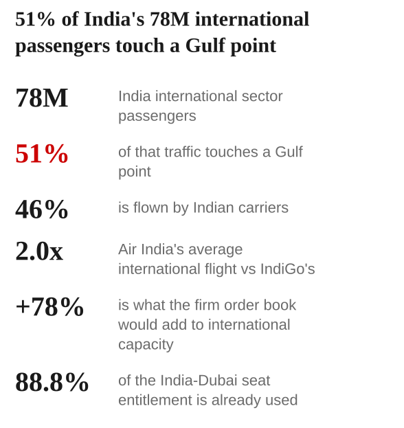
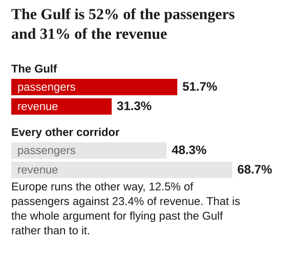
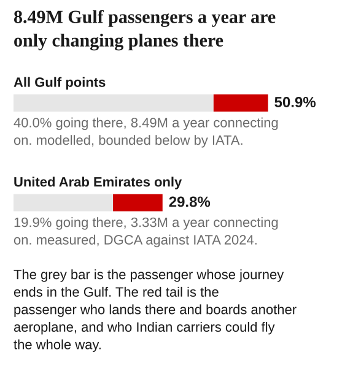
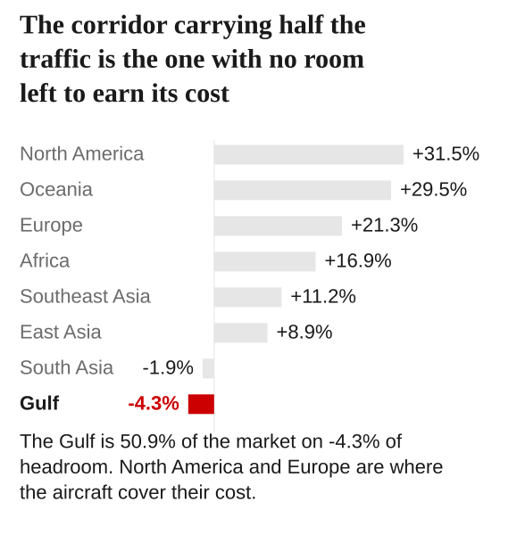
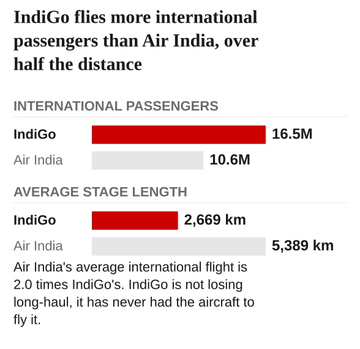
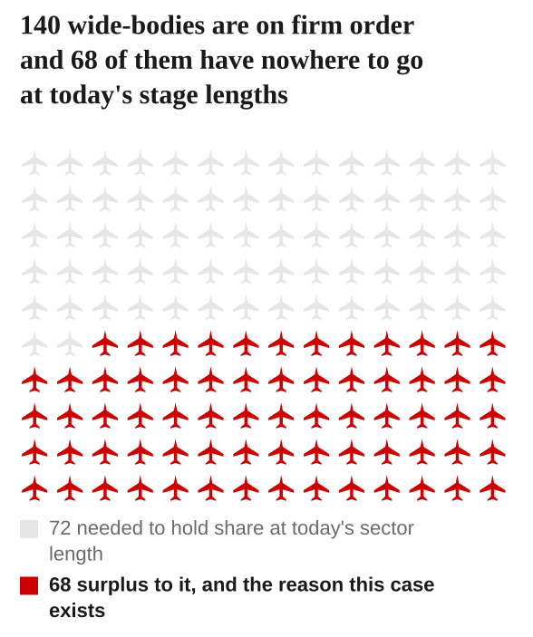
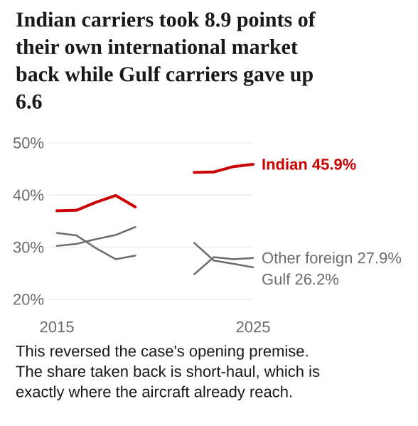
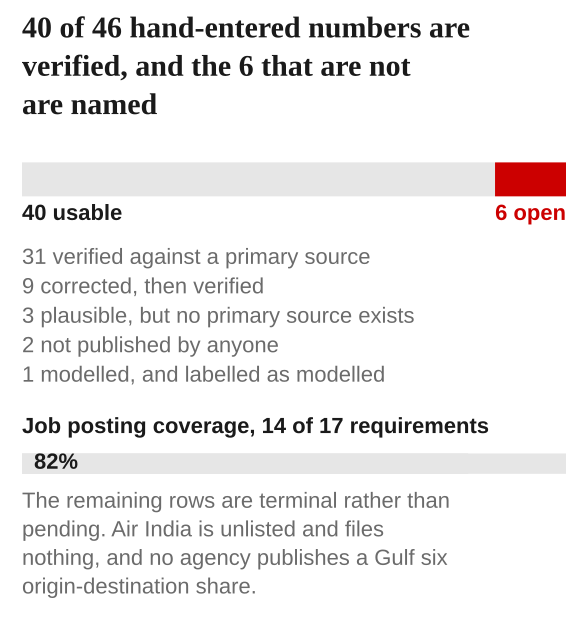
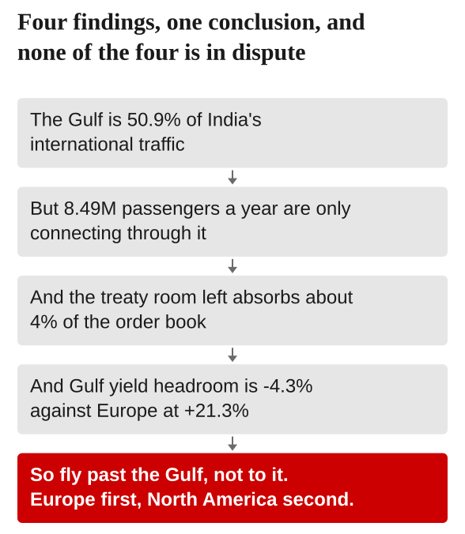
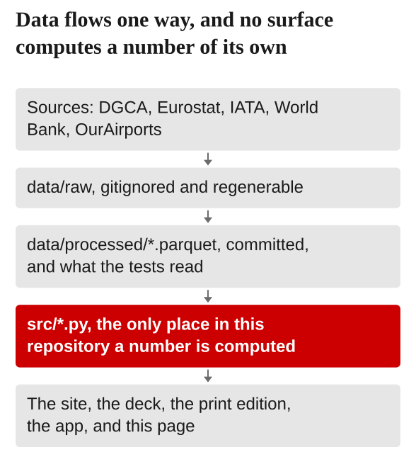

# India's Wide-Body Window

**Where should Indian carriers deploy their next 100 long-haul aircraft, and can the
India-Gulf corridor absorb them?**

> A commercial aviation market entry case in the style of Bain Capability Network Advanced
> Manufacturing & Services work. The answer is to compete with the Gulf hubs rather than fly
> more aircraft to them: Europe first, North America second, Gulf capacity roughly flat.

[](https://github.com/DogInfantry/india-widebody-window/actions/workflows/refresh.yml)


<picture>
  <source media="(prefers-color-scheme: dark)" srcset=".github/assets/kpi_strip-dark.svg">
  
</picture>

The six figures the case turns on, before any argument is made about them. Each one is computed in this repository from the committed data.

*Source: DGCA traffic statistics, pulled 2026-08-15. Computed in-repo, not quoted.*

| The engagement | |
|---|---|
| **Client** | IndiGo, network and fleet strategy |
| **The decision** | Where 60 A350-900s on firm order go first, and what to do with 40 unconverted purchase rights |
| **Against** | Air India, 80 wide-bodies on firm order |
| **Horizon** | Deployment through 2030 |
| **Evidence** | DGCA, Eurostat, IATA, World Bank and OurAirports. Every figure computed in-repo, none typed by hand |

**Read it** on [the site](https://india-widebody-window.vercel.app), as
[a deck](https://doginfantry.github.io/india-widebody-window/deck.html), in
[print](https://doginfantry.github.io/india-widebody-window/report.html), or as
[a one-pager](https://doginfantry.github.io/india-widebody-window/brief.html).
**Or jump to** [the answer](#the-answer), [the numbers](#the-numbers-this-case-turns-on), or
[the eleven times it changed](docs/pivot_log.md).

Python analysis layer, a scrollytelling site and a Next.js delivery layer. No PowerPoint and
no Excel anywhere in the pipeline.

---

## The answer

**Compete with the Gulf hubs. Do not fly more aircraft to them. Europe first, North America
second, Gulf capacity roughly flat.**

The India-Gulf corridor is the largest thing in Indian aviation and the wrong place to put a
wide-body. It carries more passengers than any other corridor and earns a third of the money.

<picture>
  <source media="(prefers-color-scheme: dark)" srcset=".github/assets/pax_vs_revenue-dark.svg">
  
</picture>

Share of India's international corridor passengers against share of corridor revenue, 2025. The 20.4 point gap is the widest of any corridor, and it is what a short sector does to a wide-body. These shares are of the eight corridors that carry a modelled revenue pool, which is why the Gulf reads 51.7% here and 50.9% of all international sectors elsewhere on this page. The denominator differs, the traffic does not.

*Source: DGCA traffic statistics for passengers; corridor revenue is computed in src/profit_pools.py at published unit economics. The margin axis of that module is modelled and every seam in it is labelled.*

About 8.5M of those passengers a year are not going to the Gulf at all. They are connecting
through Dubai, Doha or Abu Dhabi to somewhere else, which is traffic an Indian carrier could
fly the whole way.

<picture>
  <source media="(prefers-color-scheme: dark)" srcset=".github/assets/connect_gap-dark.svg">
  
</picture>

Share of India's international traffic bound for the Gulf, counted two ways. A sector counts a passenger on each leg; origin-destination counts where the passenger is actually going. The red tail is the difference, and reconciling it is the case rather than a discrepancy to argue away.

*Sources: DGCA traffic statistics and IATA, Aviation in India, both 2024. The two agencies agree to 3.7% on how many passengers leave India and disagree by 9.9 points on where they are going.*

And the corridor's sectors are short enough that unit cost stays high, so the Gulf is the only
corridor in the book that cannot cover its own cost at IndiGo's achieved yield.

<picture>
  <source media="(prefers-color-scheme: dark)" srcset=".github/assets/answer_headroom-dark.svg">
  
</picture>

Yield headroom by corridor, per cent, against IndiGo's achieved 5.06 INR per RPK at the 81% load factor Indian carriers fly internationally. Positive means the corridor clears its unit cost with room to spare. The Gulf carries 50.9% of the traffic.

*Source: DGCA traffic statistics, pulled 2026-08-15. Computed in-repo, not quoted.*

Indian carriers win that traffic by flying past the Gulf, not to it. This was not the opening
view: the case ran on "reclaim the Gulf corridor first" until three separate lines of evidence
said the aircraft cannot be deployed there. That change, and nine others, are written up in
[the pivot log](docs/pivot_log.md) rather than quietly amended.

<details>
<summary><b>What the words mean.</b> Ten terms this case turns on, in plain English.</summary>

| Term | What it means |
|---|---|
| **Stage length** | How far the average flight goes. The single most differentiating number in this case: IndiGo averages 2,669 km internationally, Air India 5,389 km. |
| **ASK** | Available seat kilometres. One seat flown one kilometre. Capacity is measured in ASK, never in seats or aircraft, because a seat is not capacity until you say how far and how often it flies. |
| **RPK** | Revenue passenger kilometres. One paying passenger flown one kilometre. ASK is what you offered, RPK is what you sold. |
| **Load factor** | RPK divided by ASK. How full the aeroplane was. |
| **RASK** | Revenue per available seat kilometre. What each unit of capacity earned. |
| **CASK** | Cost per available seat kilometre. What each unit of capacity cost. If CASK is above RASK you lost money on every seat you flew. |
| **Yield** | Revenue per revenue passenger kilometre. What one passenger paid to be carried one kilometre. |
| **Yield headroom** | How much more, or less, a corridor earns per passenger kilometre than it needs to cover its cost at that distance. Negative means the route does not pay. |
| **Bilateral entitlement** | The seats per week a treaty between two countries allows airlines to fly. A hard legal ceiling, separate from whether the flying is profitable. |
| **Origin-destination (O-D)** | Where a passenger is actually going, as against the individual flights they take. A Kochi passenger flying to London via Dubai is one O-D journey and two sectors, and that difference is this whole case. |
| **EBITDAR** | Earnings before interest, tax, depreciation, amortisation and rent. Airlines lease most of their aircraft, so rent is excluded to compare carriers that lease against carriers that own. |

</details>

## The finding, in two numbers

In 2025 **IndiGo carried more international passengers than Air India**, 16.5M against 10.6M,
while flying **barely half the distance per passenger**.

<picture>
  <source media="(prefers-color-scheme: dark)" srcset=".github/assets/stage_gap-dark.svg">
  
</picture>

Indian carriers' international operations, 2025. IndiGo is the highlighted subject in both panels because the finding is the pair, not either measure on its own.

*Source: DGCA traffic statistics, pulled 2026-08-15. Computed in-repo, not quoted.*

IndiGo is not losing long-haul. It has never been able to fly it. That gap is what the
wide-body order exists to close, and it falls straight out of two published columns with no
assumption in between.

## Why not simply fly more aircraft to the Gulf?

Because there are not enough Gulf sectors to put them on, and the ones that exist do not pay.

<picture>
  <source media="(prefers-color-scheme: dark)" srcset=".github/assets/order_book-dark.svg">
  
</picture>

One aeroplane, one glyph. 80 Air India, 60 IndiGo. The book converts to 1.95 times the capacity growth Indian carriers need to hold their 45.9% share, so the question is where the surplus flies, not whether it exists.

*Source: Airbus and Boeing order books and airport planning manuals; the capacity need is computed from DGCA. Pulled 2026-08-15.*

The book only clears if the average international sector rises about **27%**, to 4,345 km, or
Indian carriers take **58%** of the market. Neither happens on Gulf flying, where the average
sector is short. Meanwhile India-Dubai already runs at **88.8%** of its reported seat
entitlement. Abu Dhabi runs at **70.1%**, so the Gulf is not uniformly capped, but the room
left across both points absorbs about 4% of the book. The constraint is economic first and
legal second.

## The premise this project reversed

The case opened on "India is losing its own international market". The data says the opposite.

<picture>
  <source media="(prefers-color-scheme: dark)" srcset=".github/assets/share_reversal-dark.svg">
  
</picture>

Share of India international sector passengers by carrier home region, per cent, 2015 to 2025. 2020 and 2021 are omitted: repatriation flying distorts them beyond use.

*Source: DGCA traffic statistics, pulled 2026-08-15. Computed in-repo, not quoted.*

They are not losing their home market, they are closing on parity. The deficit that remains
sits exactly where aircraft range binds: the share taken back is short-haul, and long-haul
needs the aircraft that have only just been ordered.

## The numbers this case turns on

Every figure is computed in this repository from committed data unless the basis says
otherwise. Nothing is quoted from a secondary source without a second agency behind it.

<details>
<summary><b>The twelve load-bearing figures</b>, each with its period and its basis.</summary>

| Figure | What it measures | Basis |
|---|---|---|
| **78.0M** | India international sector passengers, both directions, all carriers | 2025, computed, DGCA |
| **50.9%** | Share of that traffic touching a Gulf point | 2025, computed, DGCA |
| **39.7M** | Gulf corridor passengers, 4.1x India's entire direct Europe market | 2025, computed, DGCA |
| **45.9%** against **26.2%** | Share flown by Indian carriers against Gulf carriers | 2025, computed, DGCA |
| **2,669 km** against **5,389 km** | IndiGo's average international stage length against Air India's | 2025, computed, DGCA |
| **8.5M** | Passengers a year connecting through a Gulf hub to somewhere else | 2024, modelled, bounded below at 7.84M by IATA |
| **+78%** | What the firm order book adds to Indian carrier international capacity, in ASK | firm orders, computed |
| **4%** | Share of that order book the remaining Gulf treaty room could absorb | 2025, computed |
| **-4.3%**, **+21.3%**, **+31.5%** | Yield headroom: Gulf, Europe, North America | 2025, computed |
| **96M to 109M** | India international passengers in 2030, three methods, a band and never an average | 2030, modelled |
| **88.8%** and **70.1%** | India-Dubai and India-Abu Dhabi seat entitlement already used | 2025, computed against a secondary cap |
| **17.8%** and **27.3%** | IndiGo FY2026 EBITDAR margin as reported, and excluding forex | FY2026, IndiGo primary filings |

</details>

## Five things this repo does that a summary would not

<picture>
  <source media="(prefers-color-scheme: dark)" srcset=".github/assets/evidence_ledger-dark.svg">
  
</picture>

Every number that cannot be computed from the sources is entered by hand, given a status, and gated. dp.assumption() raises rather than return a row that is not verified, so an unchecked figure stops the build instead of reaching the page.

*Source: data/manual/assumptions.csv and src/gap_analyzer.py, both committed. Coverage is measured against the real job posting in jd.txt.*

<details>
<summary><b>1. It computes the headline instead of quoting it.</b> Secondary sources say the Gulf is "around 40%" of India's international traffic. This repo computes 50.9%, and both are right.</summary>

50.9% is *sector* traffic, around 40% is true *origin-destination*. The eleven point gap is
passengers connecting through a Gulf hub to somewhere else, and it is the case rather than a
discrepancy to reconcile away.

</details>

<details>
<summary><b>2. It checks the data against a second agency, and the check found something.</b> DGCA and Eurostat agree to 2.6% across seven countries. One route diverges 37% and is quarantined.</summary>

Eurostat measures the same India-Europe routes from the European end. Across seven countries
both cover, DGCA and Eurostat agree to **2.6%** (Finland to 0.0%, Germany 1.3%, France -0.9%).
Italy diverges 37%, and the entire gap is one route: Eurostat reports 171,942 passengers on
Rome to Delhi, DGCA lists no such pair. No free source settles it, so the route is
**quarantined**, excluded from anything depending on one agency being right, and reported with
both numbers. The Gulf has a second agency too, at country level: IATA's free
`Aviation in India` puts India's departing UAE share at 19.9% of origin-destination against
DGCA's 29.8% of sectors, and that 9.9 point gap is the connecting passenger, measured rather
than assumed.

</details>

<details>
<summary><b>3. It refuses to use numbers nobody has checked, and the gate has cost it.</b> The capacity leg of the market sizing sat blocked for most of this project's life, and unblocking it made the recommendation harder to argue.</summary>

DGCA publishes no fares and Air India is unlisted, so yields must be hand-entered. Every such
row carries a status and `dp.assumption()` raises rather than returning anything not
`VERIFIED`. The capacity leg was unblocked by finding the sources, never by relaxing the rule,
and note which way that moved the answer: the new leg came in at 96.5M, the **low** end, so
verifying the gated numbers widened the band downward.

</details>

<details>
<summary><b>4. It publishes the eleven times it was wrong.</b> A margin claim withdrawn, a premise reversed, a bucket bug that misfiled 5.0M passengers a year while all 72 tests passed. Not one was caught by the test suite.</summary>

[The pivot log](docs/pivot_log.md) holds eleven documented changes of mind, each citing the commit
it happened in. A widely quoted utilisation figure was retired because it requires 100 of 441
aircraft to be grounded. A wrong bucket is still a valid bucket, which is why the tests stayed
green. Every one came from measuring something: one agency against another, a figure against
arithmetic, or a surface against the thing it was built to replace.

</details>

<details>
<summary><b>5. It reports its own gaps.</b> Coverage against the real job posting is 82%, not 100%, and the missing items are named rather than engineered away.</summary>

`python -m src.gap_analyzer` maps the real job posting to artifacts and checks each exists. It
reports **82%** because the posting asks for survey analysis, mentoring and first-level team
management, and a solo repository cannot honestly evidence any of them. It also caught a
requirement I had invented that appears nowhere in the posting, and that row was deleted rather
than reworded.

</details>

## A trap worth naming

DGCA publishes distance columns in **thousands** while passenger counts are raw, and the files
say so nowhere. Taken at face value, the average Indian domestic passenger flies 0.98 km. The
correction was confirmed three independent ways before being applied:

| Check | Result |
|---|---|
| Scale | Reproduces India's published 163.8bn domestic RPK for 2025 |
| Ratio | Computed load factor matches DGCA's own column to 0.25pp on the majors |
| Coherence | Aircraft-km and RPK columns independently give 588 and 589 km per departure |

Two tests guard it. Left uncaught it would have published a chart claiming Air India's average
international flight is 5 km.

## How the argument is built

<picture>
  <source media="(prefers-color-scheme: dark)" srcset=".github/assets/argument_chain-dark.svg">
  
</picture>

The governing thought. Each link is a separate module in src/ with its own tests, and each number below is read from the committed data rather than written into this diagram.

*Source: DGCA traffic statistics, pulled 2026-08-15. Computed in-repo, not quoted.*

## How the numbers get made

<picture>
  <source media="(prefers-color-scheme: dark)" srcset=".github/assets/pipeline-dark.svg">
  
</picture>

scripts/refresh.py is the single entry point and exactly what CI runs. docs/index.html holds the prose and every other surface re-lays it out, so a sentence cannot say one thing on the site and another in the deck.

*Source: the repository itself. scripts/refresh.py, src/app_export.py and tests/test_delivery.py enforce the direction of this arrow.*

## Frequently asked

### Where does the data come from, and can I reproduce it?

All five sources are free, machine readable and pulled by `scripts/refresh.py`. Clone the repo,
install seven packages, run the entry point.

<details>
<summary><b>The five sources with their licences</b>, why the committed parquet exists, and the two sources that were dropped.</summary>

| Source | Role | Licence |
|---|---|---|
| DGCA traffic statistics | Spine. Five datasets, fresh to May 2026 | ODbL via mirror |
| Eurostat `avia_par` | The European end of the same routes | EU reuse |
| IATA `Aviation in India` | India's departing O-D split, by region | Free |
| World Bank Open Data | Income, population, propensity, 12 peers | CC BY 4.0 |
| OurAirports | Airport reference and coordinates | CC0 |

The committed parquet is what makes the test suite deterministic and offline, so a flaky
upstream cannot turn the build red. Loaders read it by default and only hit the network when
`force=True`.

Two sources were attempted once and dropped rather than scraped unreliably: BTS T-100 and
Indian Oil fuel prices. The United States arm is therefore measured from the India side only,
and [`docs/methodology.md`](docs/methodology.md) says so.

</details>

### Why does this repo say the Gulf is 50.9% when other sources say around 40%?

They measure different things and both are right. 50.9% is the share of *sector* passengers
touching a Gulf point, which is what DGCA counts. Around 40% is the *origin-destination* share,
which is where the passenger is actually going.

<details>
<summary>What sits in the gap, and how it is now bounded by measurement.</summary>

The gap is the passenger who lands in Dubai and boards another aeroplane, roughly 8.5M a year,
and reconciling it is the case rather than a nuisance to argue away. IATA's free publication
now bounds that gap from the measurement side: Gulf six against IATA's wider Middle East gives
a lower bound of 3.92M one way, so 7.84M both ways against the 8.49M this case models. The
load-bearing modelled number is corroborated by measurement and is slightly conservative.

</details>

### What would break the recommendation?

`gulf_od_share_pct` is the softest input in the case, it is marked `UNVERIFIED_NO_PRIMARY`
because no agency publishes a Gulf six origin-destination share, and it is still the likeliest
reason this case is wrong.

<details>
<summary>The largest unquantified cost, and where the risk register lives.</summary>

Wide-body lease rates are the largest unquantified cost: the damp-lease bridge in
[`docs/recommendation.md`](docs/recommendation.md) is presented with its economics explicitly
open, because IBA and Cirium transaction rates are paywalled. A nine row risk register and a
set of leading indicators sit in the same document.

</details>

### Is any number here modelled rather than measured?

Yes, and every one says so on the chart face rather than in a footnote. `charts.finish()` takes
a `modeled=True` flag and a test fails the build if a modelled figure is published without it.

### Why is there no PowerPoint or Excel?

Because neither is in the pipeline, as output or as an intermediate. Analysis lives in Python
with tests on it, the argument lives in HTML that anyone can open, and the print edition is the
same prose re-laid out with a Save as PDF button.

### What is deliberately unfinished?

Coverage against the real job posting is **82%**, and engineering it upward would defeat the
point of the analyzer. [`ROADMAP.md`](ROADMAP.md) separates what is blocked by a paywall from
what is merely unbuilt.

<details>
<summary>The three gaps that are terminal, and why each stays a gap.</summary>

Survey analysis has a fielded-ready conjoint instrument in
[`docs/survey_design.md`](docs/survey_design.md) and no responses, because designing a survey
is not analysing one. Mentoring and first-level team management cannot be evidenced by a solo
repository.

</details>

## Run it

```bash
pip install -r requirements.txt
python scripts/refresh.py
python -m pytest -q
```

`scripts/refresh.py` pulls every source, rebuilds all eighteen figures and recomputes the hero
numbers from the parquet. `--no-fetch` rebuilds from cached parquet without going to the network.
To read the site locally, serve `docs/` with any static file server and open `index.html`.

The delivery layer:

```bash
npm --prefix web install
npm --prefix web run build
```

<details>
<summary><b>Where everything lives</b>, and the ten written documents behind the analysis.</summary>

```
src/data_pipeline.py   fetch, clean, cache; the three DGCA traps handled once, here
src/benchmarking.py    carriers and corridors; stage length is the differentiating metric
src/market_sizing.py   three methods reconciled to a band, never averaged
src/fleet_gap.py       what the order book can fly, in ASK, against what the market needs
src/options.py         what each corridor must earn to cover its cost, and the option menu
src/financials.py      the client's own P&L, unit economics and capital scale
src/profit_pools.py    corridor profit pool; the most heavily modelled module, every seam labelled
src/scenario.py        demand paths, plus fuel and FX on unit economics
src/charts.py          Bain palette builders; house rules enforced by tests
src/app_export.py      tidy JSON for the delivery layer, from the functions the charts call
src/gap_analyzer.py    job posting to artifact coverage, checked not assumed
scripts/refresh.py     single entry point, and what CI calls
docs/                  the scrollytelling site, the deck, the print edition and the written IP
web/                   the Next.js delivery layer, seven routes, 26 exhibits
```

| Document | What it holds |
|---|---|
| [Storyline](docs/storyline.md) | The client brief, the recommendation, and the SCQA under it |
| [Recommendation](docs/recommendation.md) | Five costed options, roadmap, risk register, leading indicators |
| [Pivot log](docs/pivot_log.md) | The eleven times evidence turned the analysis, each citing its commit |
| [Hypothesis tree](docs/hypothesis_tree.md) | The decomposition, including branches still open |
| [Survey design](docs/survey_design.md) | A conjoint instrument for the softest number in the case. Designed, not fielded |
| [Methodology](docs/methodology.md) | Frameworks, limits, what the data cannot tell you, and the retraction |
| [Data dictionary](data/data_dictionary.md) | Every field: source, pull date, reliability grade |
| [Coverage](docs/coverage.md) | Job posting mapped to artifacts, gaps included |
| [Alternative B](docs/alternative_b_datacenters.md) | The case that lost, and why |
| [External review response](docs/external_review_response.md) | An outside review, answered item by item |

</details>

<details>
<summary><b>How to cite this work.</b></summary>

> Rawat, A. (2026). *India's Wide-Body Window: where should Indian carriers deploy their next 100
> long-haul aircraft, and can the India-Gulf corridor absorb them?*
> https://india-widebody-window.vercel.app

```bibtex
@misc{indiawidebodywindow2026,
  author       = {Rawat, Anklesh},
  title        = {India's Wide-Body Window: where should Indian carriers deploy
                  their next 100 long-haul aircraft, and can the India-Gulf
                  corridor absorb them?},
  year         = {2026},
  howpublished = {\url{https://india-widebody-window.vercel.app}},
  note         = {Source and data at \url{https://github.com/DogInfantry/india-widebody-window}}
}
```

</details>

## Licence and attribution

Apache-2.0. The Mekko builder is adapted from [Vizro](https://github.com/mckinsey/vizro),
also Apache-2.0, whose chart taxonomy derives from the FT Visual Vocabulary (MIT). The
basemap is Natural Earth, public domain. Full attribution in [`NOTICE`](NOTICE), which
Apache-2.0 section 4(d) makes a requirement rather than the courtesy it was before.
